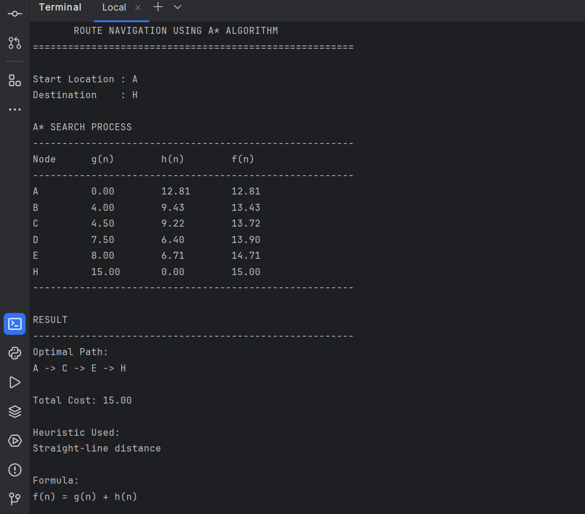
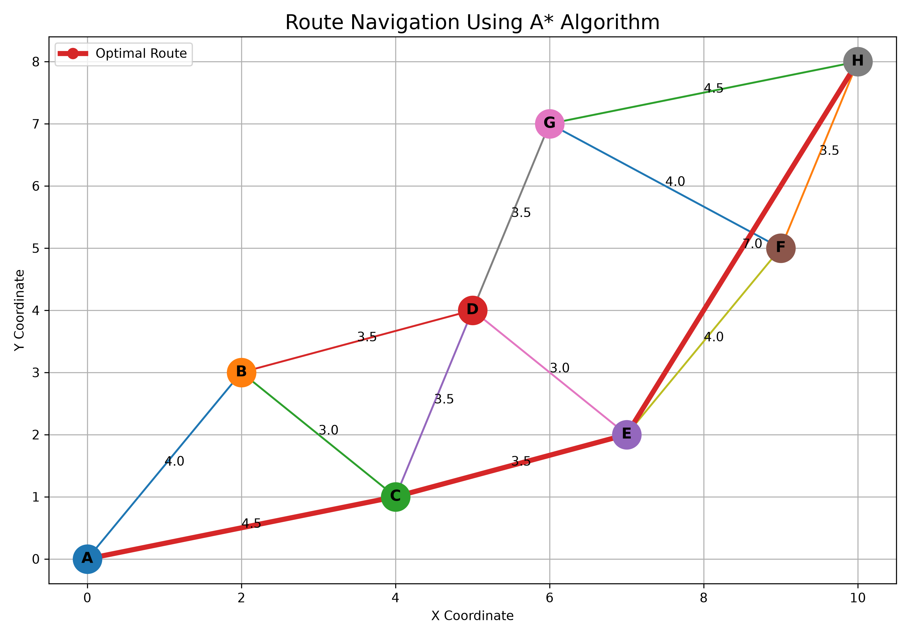

# Route Navigation Using A* Algorithm

## 1. Project Title

**Route Navigation Using A* Algorithm**

---

## 2. Problem Statement

Route navigation requires finding the optimal path between a source location and a destination in a weighted map.

A map can be represented as a weighted graph where locations are represented as nodes and roads are represented as edges. Each edge has a weight representing the travel distance or cost.

The objective of this project is to implement the A* search algorithm to find the optimal route between two locations using a straight-line-distance heuristic.

The project also demonstrates the evaluation:

**f(n) = g(n) + h(n)**

where:

- **g(n)** is the actual cost from the starting location to the current location.
- **h(n)** is the estimated cost from the current location to the destination.
- **f(n)** is the estimated total cost of the route through the current location.

---

## 3. Objectives

The main objectives of this project are:

- To implement the A* search algorithm.
- To represent a map using a weighted graph.
- To assign travel costs to the edges of the graph.
- To calculate the actual path cost g(n).
- To calculate the heuristic value h(n).
- To calculate f(n) using f(n) = g(n) + h(n).
- To find the optimal route between a source and destination.
- To calculate the total cost of the optimal route.
- To demonstrate the admissibility of the straight-line-distance heuristic.
- To visualize the weighted map and optimal route.

---

## 4. Technologies Used

- **Python 3**
- **A* Search Algorithm**
- **Graph Data Structure**
- **Priority Queue**
- **Matplotlib**
- **PyCharm**

Python's built-in `heapq` module is used to implement the priority queue.

---

## 5. Dataset

The project uses a manually created weighted map dataset.

The map contains eight locations:

**A, B, C, D, E, F, G and H**

Each location has:

- X and Y coordinates.
- Connections to neighbouring locations.
- Travel costs for connected roads.

The coordinates are used to calculate the straight-line-distance heuristic.

Example:
``` 
A = (0, 0)
B = (2, 3)
C = (4, 1)
D = (5, 4)
E = (7, 2)
F = (9, 5)
G = (6, 7)
H = (10, 8)

``` 

## 6. Methodology

The A* (A-Star) algorithm is used to find the optimal route between a source location and a destination location in a weighted map.

The algorithm evaluates each location using the following formula:

f(n) = g(n) + h(n)

Where:

- g(n) = Actual cost from the starting location to the current location.
- h(n) = Estimated cost from the current location to the destination.
- f(n) = Total estimated cost.

### Step 1: Initialize

The starting location is added to the priority queue with its calculated f(n) value.

### Step 2: Calculate g(n)

The actual travel cost from the starting location to the current location is calculated.

### Step 3: Calculate h(n)

The straight-line distance between the current location and the destination is calculated using the coordinates.

The formula is:

h(n) = √((x₂ - x₁)² + (y₂ - y₁)²)

### Step 4: Calculate f(n)

The total estimated cost is calculated as:

f(n) = g(n) + h(n)

### Step 5: Select the Best Node

The node having the lowest f(n) value is selected from the priority queue.

### Step 6: Explore Neighbours

The algorithm checks all connected neighbouring locations and updates their costs if a better route is found.

### Step 7: Reach the Destination

The process continues until the destination node is reached.

### Step 8: Reconstruct the Route

The parent information stored during the search is used to reconstruct the optimal path from the destination back to the starting location.

### Admissible Heuristic

The project uses straight-line distance as the heuristic.

The heuristic is admissible because it does not overestimate the actual shortest travel distance when the edge weights represent travel distances and are greater than or equal to the corresponding straight-line distances.

Therefore:

h(n) ≤ Actual Remaining Cost

This allows A* to find an optimal route in the given weighted graph


## 7. System Architecture

The system consists of the following major components:

### 1. Map Dataset

The map dataset contains the locations, their coordinates, connections and travel costs.

### 2. Graph Construction

The locations are represented as nodes and roads are represented as weighted edges.

### 3. A* Algorithm

The A* algorithm searches the graph using:

f(n) = g(n) + h(n)

It selects the most promising node based on the lowest f(n) value.

### 4. Heuristic Calculation

Straight-line distance is calculated using the coordinates of the current node and destination.

### 5. Path Reconstruction

After reaching the destination, the parent nodes are used to reconstruct the optimal route.

### 6. Result Generation

The system displays:

- Search process
- g(n) value
- h(n) value
- f(n) value
- Optimal path
- Total route cost


### 7. Visualization

Matplotlib is used to generate a visual representation of the weighted map and highlight the optimal route.

### System Flow

```text
             Weighted Map Dataset
                      |
                      ↓
              Graph Construction
                      |
                      ↓
             Select Source & Goal
                      |
                      ↓
                 Calculate g(n)
                      |
                      ↓
                 Calculate h(n)
                      |
                      ↓
             Calculate f(n)=g(n)+h(n)
                      |
                      ↓
             Select Lowest f(n)
                      |
                      ↓
              Explore Neighbours
                      |
                      ↓
              Update Path Costs
                      |
                      ↓
               Destination?
                 /       \
               No         Yes
               |           |
               └───→───────┘
                           |
                           ↓
                  Reconstruct Path
                           |
                           ↓
                    Optimal Route
                           |
                           ↓
                    Total Cost
                           |
                           ↓
                    Visualization

``` 

## 8. Implementation

The project is implemented using Python and is divided into separate modules for better organization.

### Dataset Implementation

The file `dataset/map_data.py` contains the weighted graph and coordinates of all locations.

The graph represents:

- Locations as nodes.
- Roads as edges.
- Travel distance/cost as edge weights.

### A* Algorithm Implementation

The file `src/astar.py` implements the A* search algorithm.

The algorithm uses a priority queue to select the node with the lowest f(n) value.

The following values are calculated during the search:

```text
g(n) = Actual cost from the start node
h(n) = Estimated cost to the destination
f(n) = g(n) + h(n)

```
---

# 9. Results

```markdown
## 9. Results

The implemented A* algorithm successfully finds the optimal route from the source location to the destination.

### Test Case

```
Start Location : A
Destination    : H


---

# 10. Screenshots

This section will display the **two images you already created**.


## 10. Screenshots

### A* Algorithm Output

The following screenshot shows the A* search process, including the values of g(n), h(n), and f(n), followed by the optimal path and total cost.



### Weighted Map and Optimal Route

The following visualization shows the weighted map and the optimal route found by the A* algorithm.



### Optimal Route

The highlighted route is:

```text
A -> C -> E -> H
```
## 11. How to Run

### Requirements

- Python 3.x
- Matplotlib
- PyCharm or any Python-compatible IDE

### Step 1: Clone the Repository

```
git clone <YOUR-GITHUB-REPOSITORY-LINK>
```
Step 2: Open the Project Folder cd Route-Navigation-Using-A-Algorithm

Step 3: Install Required Libraries
pip install -r requirements.txt

Step 4: Run the A* Algorithm
python src/astar.py

The program displays the A* search process, including g(n), h(n), and f(n), followed by the optimal route and total cost.

Step 5: Generate the Route Visualization
python src/visualize.py

The route map is generated and saved as:

results/route_map.png


---

# 12. Future Enhancement

```markdown
## 12. Future Enhancement

The current project uses a manually created weighted map. It can be enhanced in the future with the following features:

- Use real-world geographical locations.
- Integrate GPS-based navigation.
- Add interactive maps.
- Include real-time traffic information.
- Dynamically update road weights based on traffic conditions.
- Support multiple source and destination locations.
- Compare A* with Dijkstra's algorithm.
- Add alternative route suggestions.
- Develop a web-based route navigation interface.
- Provide real-time route updates.

## 13. Team Members

| Name | Role |
|------|------|
| YOUR NAME | NIVAL RAO J R - PROJECT DEVELOPER|
| TEAM MEMBER 2 | NOVAL ESWAR |
| TEAM MEMBER 3 | VIJAY D S |

